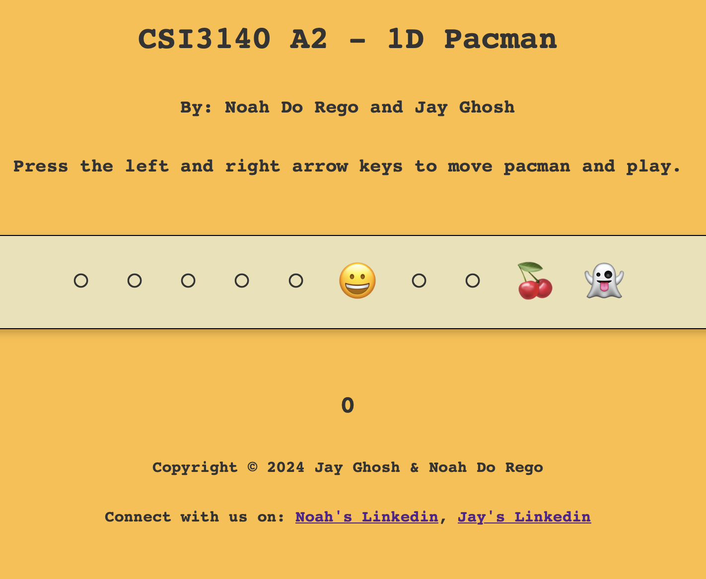
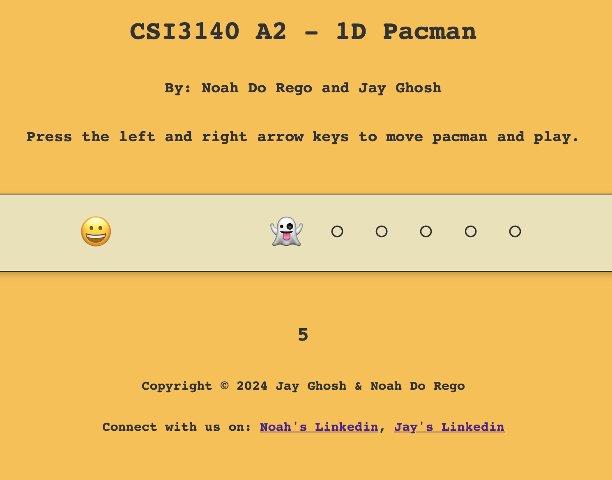
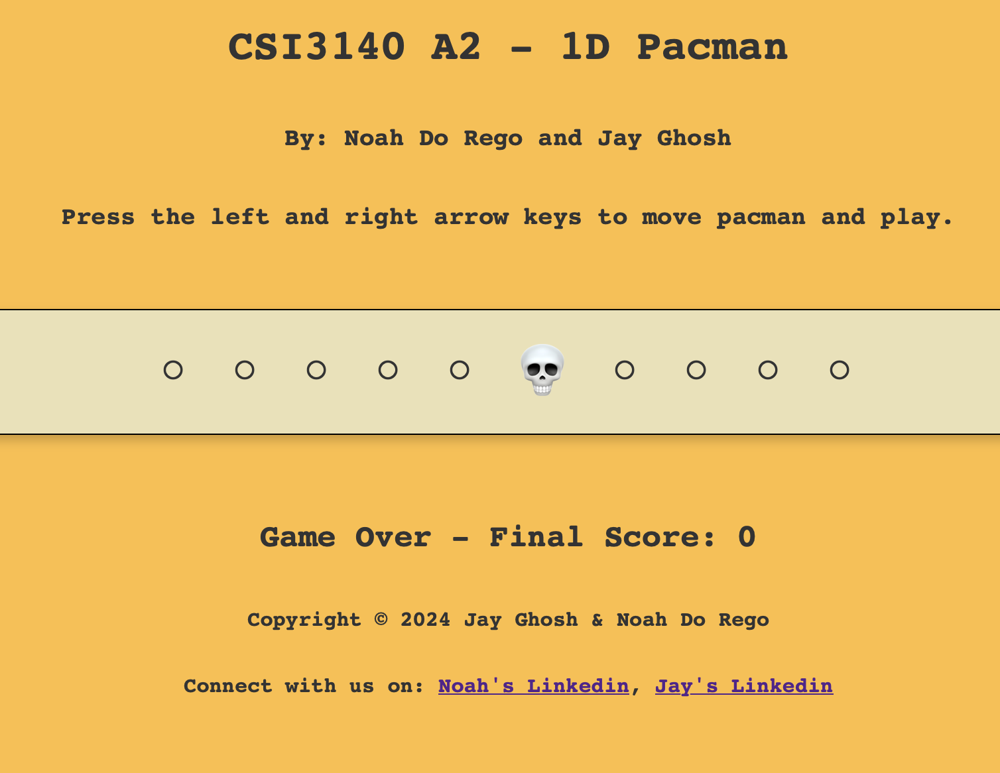

# 1D Pacman (CSI3140 Assignment 2)
**Authors**: 
- Jay Ghosh (300243766) 
- Noah Do Rego ()

## Rules: 
- Use the ```LEFT``` and ```RIGHT``` arrow keys to move PACMAN consume as many hollow circles as possible without encountering a ghost.
- Points are gained by consuming hollow circles and 
- If PACMAN encounters a ghost, the game ends and the final score is printed out.
- If PACMAN encounters a cherry,
- If PACMAN encounters a suprised face,

## Game States:
#### Game Started


#### Game In Progress


#### Game Over


## Design System:
[Link to design system](docs/design_system.md)
